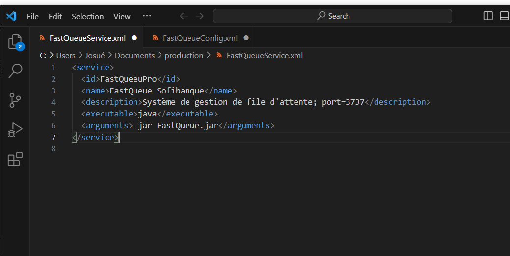
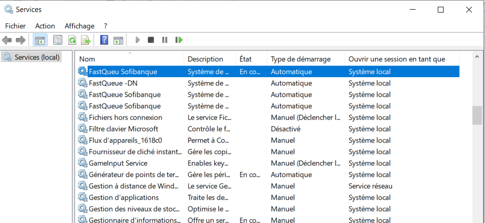

# Guide de Déploiement de FastQueue

### Pré-requis : Installation de Java

1. Assurez-vous d’installer **Java 17**, qui est requis pour cette version de FastQueue.

   
   
   

2. Une fois l’installation terminée, ouvrez l’invite de commande et exécutez la commande suivante :
   ```cmd
   java -version
   ```
   Cela permettra de vérifier que Java est correctement installé et de confirmer la version.

---

### Déploiement de l’application
1. **Extraction des fichiers :**
   - Décompressez le fichier du projet FastQueue. Vous obtiendrez les éléments suivants :

     
     - **Dossier `db` :** Contient la base de données.
     - **Dossier `logs` :** Contient les journaux de l’application.
     - **Fichier `FastQueueService.xml` :** Contient les informations nécessaires pour configurer le service Windows :

     
       - **id :** Identifiant unique attribué au service.
       - **name :** Nom du service.
       - **description :** Brève description du service.
       - **exécutable :** Indique qu’il s’agit d’une application Java.
       - **arguments :** Arguments à passer lors de l’exécution du fichier JAR.

2. **Création du service Windows :**
   - Ouvrez l’invite de commande dans le dossier contenant les fichiers extraits.
   - Exécutez la commande suivante :
     ```cmd
    FastQueueService.exe install
     ```
   - Un message indiquant que la tâche a été exécutée avec succès ("successfully") s’affichera.

   

3. **Vérification et démarrage du service :**
   - Ouvrez le gestionnaire de services Windows pour vérifier que le service **FastQueue** a bien été créé.

   
   - Démarrez le service et configurez-le pour qu’il démarre automatiquement après un redémarrage du système.

   

4. **Redémarrage et test :**
   - Redémarrez votre système.

   
   - Testez le lien de l’application pour vous assurer que tout fonctionne correctement.

   

---

### Conclusion
L’application **FastQueue** a été correctement déployée. Elle est désormais prête à être utilisée par les utilisateurs.


