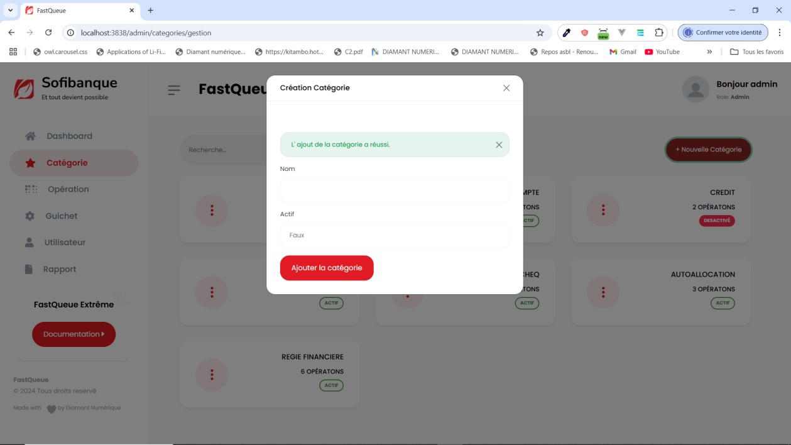

# Gestion des catégories

### 1. Création d’une catégorie
Pour créer une nouvelle catégorie dans le système :  
1. Cliquez sur le menu **Catégorie** situé dans la barre de navigation.  
2. Cliquez sur le bouton **Nouvelle Catégorie**.  

3. Remplissez le formulaire avec les informations suivantes :  
   - **Nom de la catégorie** : Donnez un titre clair et précis.  
   - **Description** (facultative) : Ajoutez une brève description si nécessaire.  
   - **Statut** : Indiquez si la catégorie est active ou désactivée dès sa création.  
4. Cliquez sur **Ajouter la catégorie** pour valider la création.  
5. Une notification ou un message de confirmation s’affichera pour indiquer que la catégorie a été ajoutée avec succès.

---

### 2. Modification d’une catégorie
Pour modifier une catégorie existante :  
1. Identifiez la catégorie que vous souhaitez modifier dans la liste des catégories.  
2. Cliquez sur les **trois points verticaux** situés à la fin de la ligne de la catégorie.  
3. Sélectionnez **Modifier** dans le menu contextuel. 

4. Dans le formulaire de modification, vous pouvez :  
   - Changer le **nom** ou la **description** de la catégorie.  
   - Activer ou désactiver la catégorie selon vos besoins.  
5. Cliquez sur **Modifier la catégorie** pour enregistrer les modifications.  
6. Vérifiez que les changements sont bien reflétés dans la liste.

---

### Gestion des statuts des catégories
- **Catégories actives** : Ces catégories sont disponibles pour être utilisées dans d'autres modules du système.  
- **Catégories désactivées** : Ces catégories restent dans la base de données mais ne sont pas visibles ou utilisables par les autres utilisateurs.

---

### Remarque
Une gestion efficace des catégories permet d'organiser et de structurer les données de manière claire et cohérente. En cas de besoin, vous pouvez toujours réactiver une catégorie désactivée pour la rendre de nouveau disponible.  
