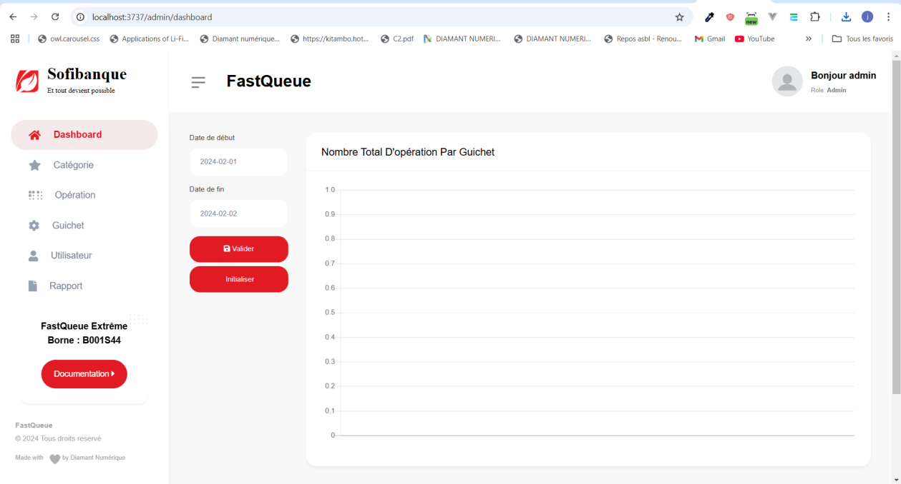
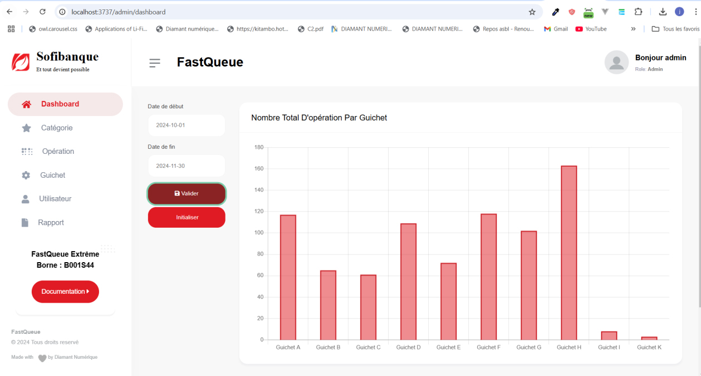

# Gestion du tableau de bord

### Accéder au tableau de bord
Après vous être authentifié, cliquez sur l'onglet **Dashboard** pour afficher la page du tableau de bord.

Le tableau de bord affiche automatiquement le nombre de tickets traités par chaque guichet pour la journée en cours.

---

### Filtrer les données par période
1. Vous pouvez afficher des données spécifiques en définissant une période.
2. Indiquez un **intervalle de dates** à l’aide du format suivant : **Année-Mois-Jour** (exemple : 2024-11-20).
3. Une fois la période définie, les données correspondant à cet intervalle seront affichées.

---

### Remarque
Le tableau de bord est conçu pour offrir une vue d'ensemble rapide des performances des guichets en fonction des tickets traités.

---
