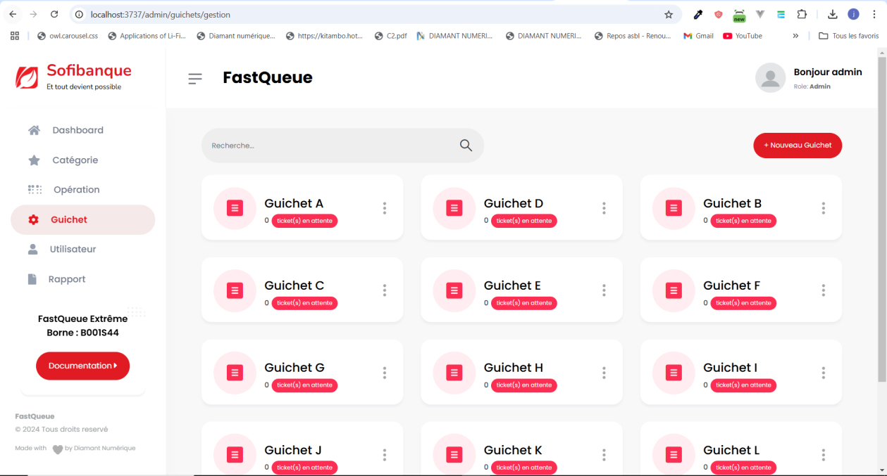
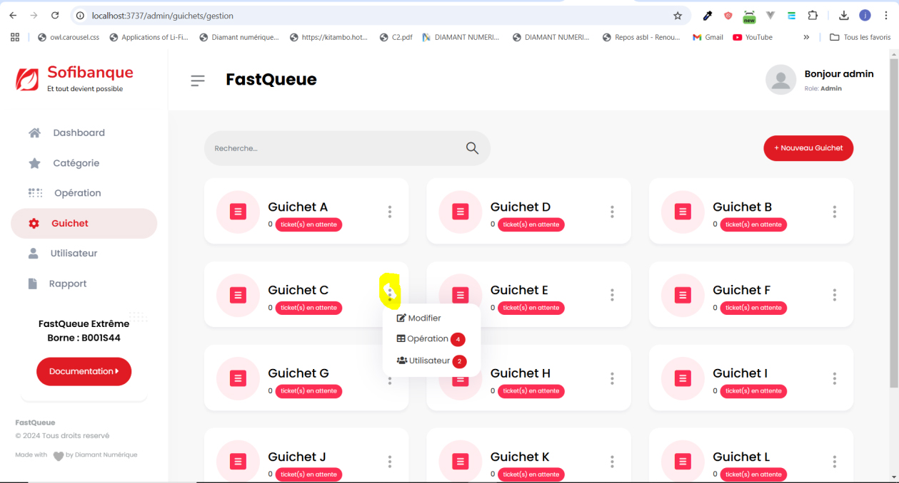
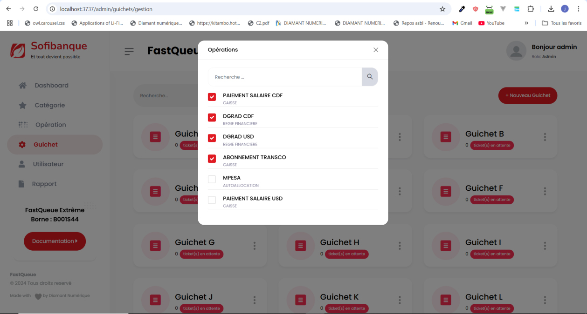
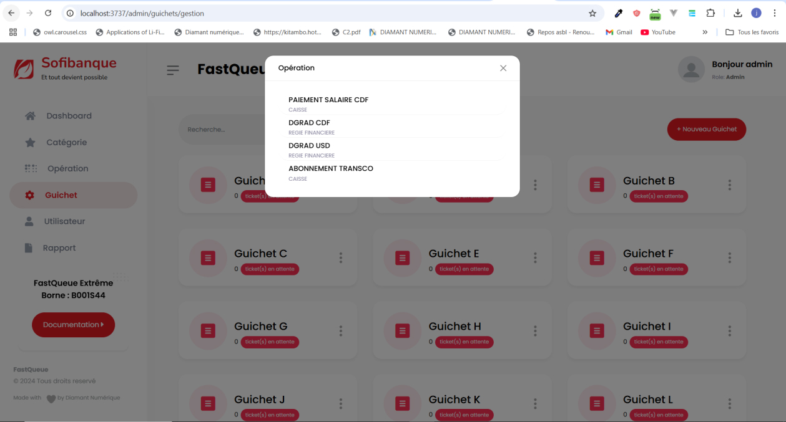
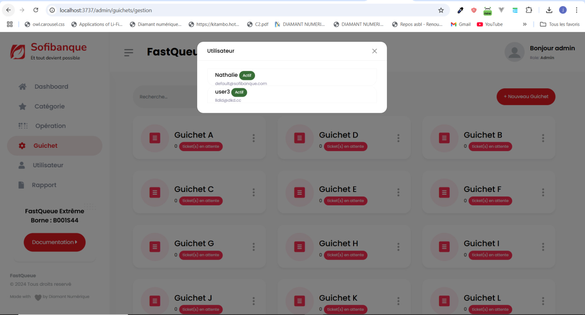

# Gestion des guichets

### Affichage des guichets
Après avoir cliqué sur l’onglet **Guichet**, le système affiche une liste de tous les guichets. Les guichets sont triés automatiquement selon le nombre de tickets en attente, en commençant par celui ayant le plus de tickets.

---

### Options disponibles pour chaque guichet
Chaque guichet est associé à une petite icône située à droite, contenant un menu déroulant avec plusieurs options administratives.

1. **Modifier :**
   - Permet à l’administrateur d’ajouter ou de retirer des opérations liées au guichet.
   - Les modifications effectuées ici ne peuvent pas être altérées par les guichetiers, garantissant une gestion centralisée des opérations.

   

2. **Opérations :**
   - Affiche une liste détaillée de toutes les opérations associées au guichet.

   

3. **Utilisateur :**
   - Permet de consulter tous les utilisateurs liés au guichet sélectionné.

   

---

### Remarque
Seuls les administrateurs ont accès aux options de modification et de gestion des guichets. Les guichetiers ne peuvent pas modifier les opérations définies par l’administrateur.
