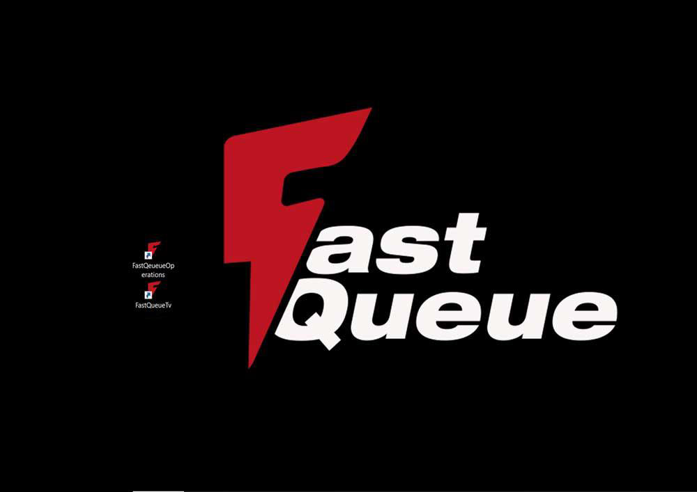

# Tâches matinales quotidiennes

### Préparation du kiosque
Après avoir allumé le kiosque, assurez-vous que le bureau dispose des **deux raccourcis** nécessaires :  
1. **Raccourci pour afficher l'interface TV** : Permet de projeter l'image sur la télévision. 
2. **Raccourci pour la page des opérations** : Permet d'afficher la page destinée à la gestion des opérations.

---

### Interface TV
- **Étape 1** : Exécutez le raccourci **TV** pour afficher l'interface prévue pour la télévision.
- **Étape 2** : Vérifiez que l'image projetée correspond à celle attendue. (L’image devrait ressembler à celle indiquée dans la documentation.)

---

### Page des opérations
- **Étape 1** : Cliquez sur le raccourci **Opérations**.
- **Étape 2** : La page affichée doit permettre aux clients ou au réceptionniste de :
  - **Sélectionner une opération** parmi les options disponibles.
  - **Imprimer le ticket** correspondant à l'opération choisie.

---

### Remarque
Ces tâches matinales sont essentielles pour garantir le bon fonctionnement du kiosque et une expérience fluide pour les utilisateurs.
