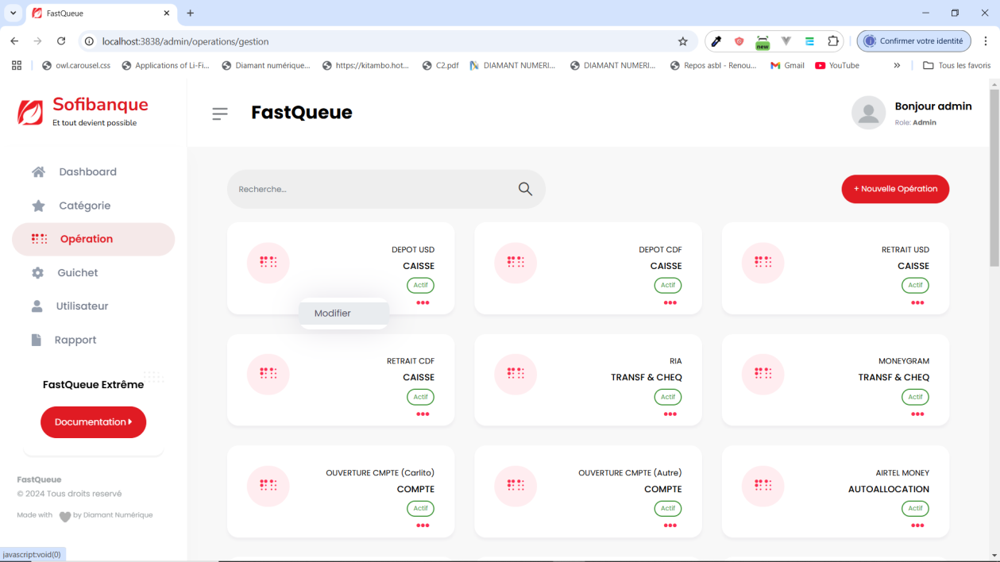

# Gestion des opérations

### Accéder à la gestion des opérations
Cliquez sur l’onglet **Opération** pour afficher la liste de toutes les des opérations disponibles.

###  Ajout d’une opération
1. Cliquez sur le bouton **+ Nouvelle Opération**.
2. Remplissez le formulaire avec les informations nécessaires.
3. Cliquez sur **Ajouter l’opération** pour enregistrer.

---

### Modification d’une opération
1. Cliquez sur les **trois points** situés sous le statut de l’opération à modifier.
2. Sélectionnez **Modifier** dans le menu.

3. Mettez à jour les informations dans le formulaire.
4. Cliquez sur **Modifier l’opération** pour enregistrer les modifications.

---

### Remarque
Ces actions permettent de gérer facilement les opérations dans le système
