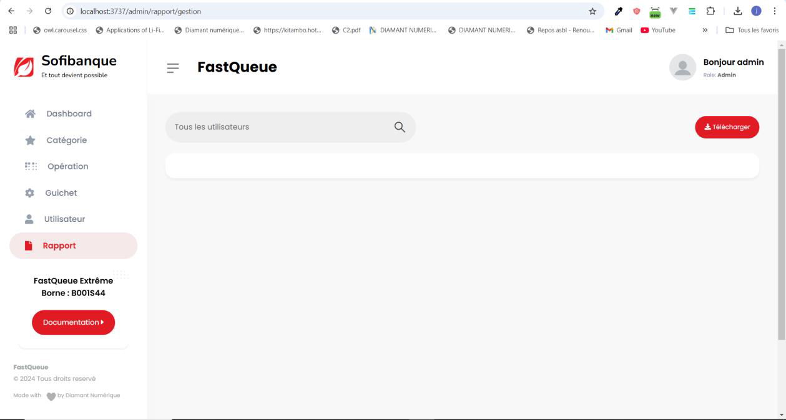
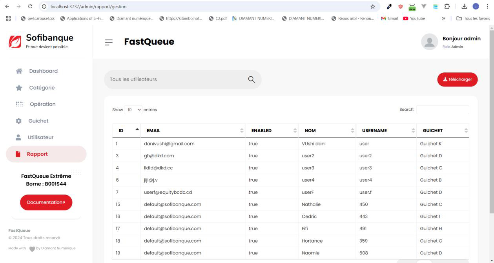
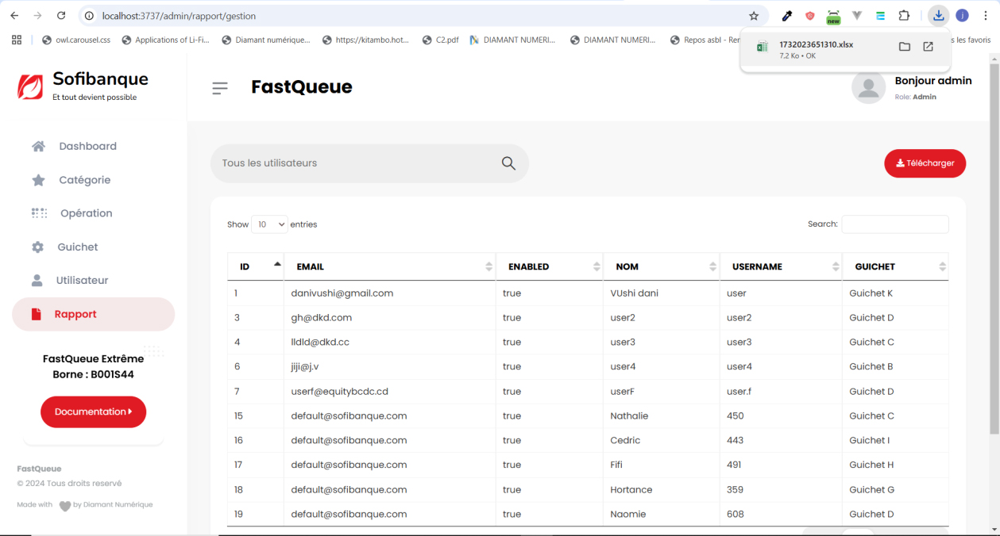

# Gestion des rapports

### Exportation des rapports
L’administrateur a la possibilité d’exporter des rapports préalablement implémentés dans le système.

---

### Procédure
1. **Sélection du rapport** :
   - Sélectionnez le nom du rapport dans la liste disponible.
   - Cliquez sur l’icône de **recherche** pour :
     - Afficher le rapport directement.
     - Afficher une fenêtre de paramètres si le rapport nécessite des paramètres spécifiques.

2. **Téléchargement** :
   - Une fois le rapport affiché, cliquez sur le bouton **Télécharger** pour obtenir le rapport au format **Excel**.

---

### Remarque
Cette fonctionnalité permet une gestion et une analyse efficace des données exportées à l’aide des outils Excel.
