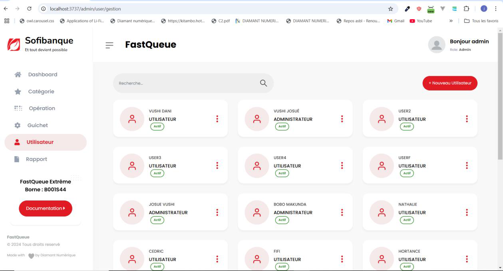
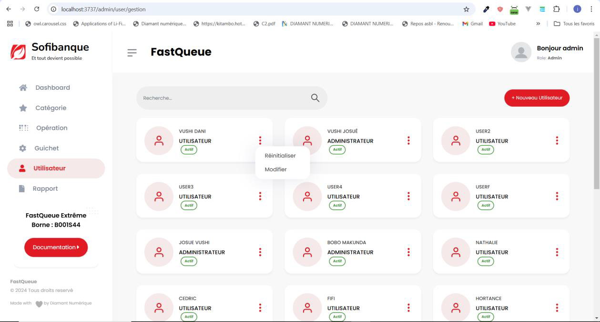
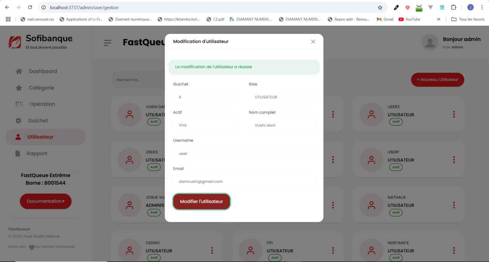
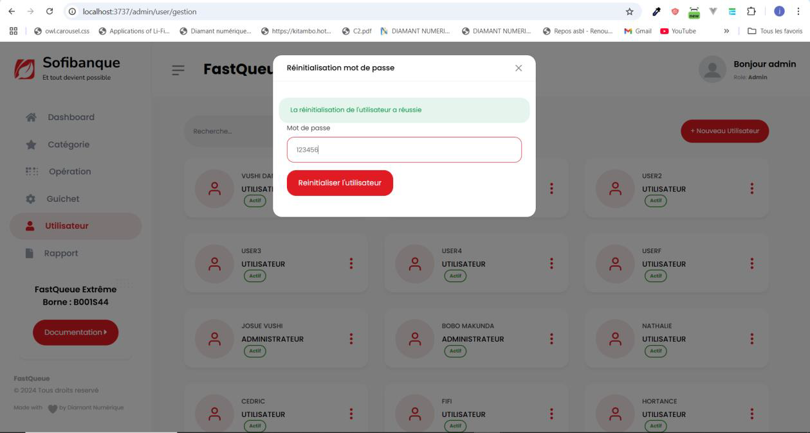

# Gestionnaire d’utilisateur

### Accéder à la gestion des utilisateurs
1. Cliquez sur l’onglet **Utilisateur** pour afficher la liste de tous les utilisateurs du système, qu’ils soient actifs ou désactivés.

2. Chaque utilisateur dispose d’un menu contextuel accessible en cliquant sur les **trois points rouges** à la fin de la ligne correspondante.

---

### Modification d’un utilisateur
- Pour modifier les informations liées à un utilisateur :
  1. Cliquez sur **Modifier** dans le menu contextuel.
  2. Vous pouvez changer les informations suivantes :
     - Guichet d’affectation.
     - Rôle.
     - Nom d’utilisateur.
     - Adresse e-mail.
     - Nom complet.
     - Statut (activer/désactiver l’utilisateur).
  3. Une fois les modifications effectuées, cliquez sur le bouton **Modifier l’utilisateur** pour enregistrer les changements.

  

---

### Création d’un nouvel utilisateur
- Pour ajouter un nouvel utilisateur :
  1. Cliquez sur le bouton **Nouveau utilisateur**.
  2. Remplissez le formulaire avec les informations nécessaires.
  3. Cliquez sur **Ajouter l’utilisateur**.
  4. Une fois l’utilisateur créé, le système l’obligera à changer son mot de passe lors de sa première connexion.

  

---

### Réinitialisation d’un utilisateur
- Pour réinitialiser le mot de passe d’un utilisateur :
  1. Cliquez sur les **trois points rouges** pour ouvrir le menu contextuel.
  2. Sélectionnez **Initialiser l’utilisateur**.
  3. Le mot de passe de l’utilisateur sera remplacé par un mot de passe par défaut.
  4. Lors de sa prochaine connexion, l’utilisateur sera forcé de changer ce mot de passe.

  

---

### Remarque
Ces fonctionnalités vous permettent de gérer efficacement les utilisateurs du système, en assurant la sécurité et le contrôle des accès.

